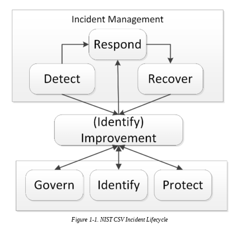
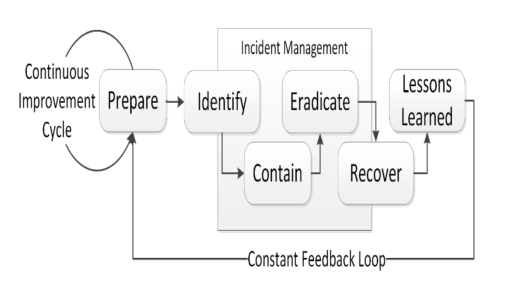

# Blue-team-tools

Practical toolkit for blue teams to detect, analyze, and mitigate cyber threats effectively, includes: tips & tricks, scripts, configurations, and tools for incident response, malware analysis, network monitoring, and threat intelligence.


# Incident response lifecycle

The Incident Response lifecycle refers to the structured process used by blue teams to protect, detect, respond to, and recover from cyber threats

This standards are employed by blue teams


## NIST Incident Response Lifecycle

NIST IR lifecycle is a structured framework focused on reactive and structured incident response standard for blue teams in most organizations

### NIST SP 800-61 Rev. 2




### NIST SP 800-61 Rev. 3

1. Preparation: Harden systems, train teams, deploy tools (SIEM, EDR).

2. Detection & monitoring: Use logs, alerts, and baselines to spot anomalies.

3. Threat analysis: Confirm incidents, assess scope and impact.

4. Containment: Isolate systems to stop spread (short- and long-term).

5. Eradication: Remove malware, patch vulnerabilities, close backdoors.

6. Recovery: Restore systems, monitor for recurrence.

7. Lessons Learned: Review incident, update playbooks, improve defenses


## SANS Incident Response  lifecycle (PICERL)




This SANS lifecycle emphasizes continuous improvement, integrating threat intelligence and proactive measures like threat hunting and vulnerability management


### 📁 Project structure

<details>
<summary>📂 Click to expand</summary>

```bash
blue-team-tools/
│
├── README.md                     # Overview, usage, and setup
│
├── docs/
│   ├── index.md                  # Landing page for GitHub Pages
│   ├── ir-playbooks.md           # Incident response workflows
│   ├── malware-analysis.md       # Malware analysis notes/tips
│   ├── network-monitoring.md     # Setup guides for Zeek, Suricata, etc.
│   └── threat-intel.md           # Threat intel sources, enrichment methods
│
├── scripts/
│   ├── incident-response/
│   │
│   ├── malware-analysis/
│   │   ├── yara_rules/
│   │   ├── unpackers/
│   │   └── sandbox_helpers/
│   │
│   ├── network-monitoring/
│   │   ├── zeek/
│   │   └── suricata/
│   │
│   └── threat-intel/
│       └── indicators/  # Indicator of compromise (IOCs)
│
├── configs/
│   ├── sysmon/
│   ├── wazuh/
│
└── tips-and-tricks/
    ├── powershell-snippets.md
    ├── bash-oneliners.md
    ├── python-tricks.md
    └── detection-engineering.md
```
</details>


### Blue team roles

| Category  | Roles       |
|-----------|-------------|
| Proactive | - Threat hunter <br> - Defense engineer <br> - Malware analyst <br> - Network Administrator |
| Reactive | - Security Operations Center (SOC) <br> - Incident Response (IR) <br> - Compliance officer <br> - Network manager |


### Technical controls

- Network segmentation
- Firewalls
- Intrusion Detection Systems (IDS)
- Intrusion Prevention Systems (IPS)
- Honeypots
- Proxy servers
- Virtual Private Networks (VPNs)
- Security Information and Event Management (SIEM) systems
- User and Entity Behavior Analytics (UBA)
- Anti-malware software.


## 💡 Tips & Tricks

Check out the [tips-and-tricks/](https://github.com/80h3m14n/blue-team-tools/tree/main/tips-and-tricks) folder for:

- [PowerShell snippets](https://github.com/80h3m14n/blue-team-tools/blob/main/tips-and-tricks/powershell-snippets.md)
- [Bash oneliners](https://github.com/80h3m14n/blue-team-tools/blob/main/tips-and-tricks/bash-oneliners.md)
- [Detection engineering tricks](https://github.com/80h3m14n/blue-team-tools/blob/main/tips-and-tricks/detection-engineering.md)
- [Python tricks](https://github.com/80h3m14n/blue-team-tools/blob/main/tips-and-tricks/python-tricks.md)
- [Threat hunting tips](https://github.com/80h3m14n/blue-team-tools/blob/main/tips-and-tricks/threat-hunting.md)


✅ Actively hunt threats and never solely rely on tools

✅ Invest in your infrastructure

✅ Learn to adapt to changes

✅ Have the mindset of an attacker 

✅ If you happen to opt to outsource, make sure to choose the right vendor  


## 📘 Docs

Detailed guides & notes live in the [docs/](https://github.com/80h3m14n/blue-team-tools/tree/main/docs) folder.  
Use it like a blue team wiki — IR playbooks, network tuning, malware triage checklists, etc.

- [IR Playbooks](https://github.com/80h3m14n/blue-team-tools/blob/main/docs/ir-playbooks.md)
- [Malware Analysis](https://github.com/80h3m14n/blue-team-tools/blob/main/docs/malware-analysis.md)
- [Network Monitoring](https://github.com/80h3m14n/blue-team-tools/blob/main/docs/network-monitoring.md)
- [Preparation](https://github.com/80h3m14n/blue-team-tools/blob/main/docs/preparation.md)
- [Threat Intel](https://github.com/80h3m14n/blue-team-tools/blob/main/docs/threat-intel.md)


## Additional resources

- [D3fend MITRE](https://d3fend.mitre.org/)
- [Microsoft Security Response Center](https://msrc.microsoft.com)
- [Opensecuritytraining](https://opensecuritytraining.info/Welcome.html)
- [Privacy International](https://privacyinternational.org/learn)
- [SANS cyber races](https://www.sans.org/cyberaces)
- [Threat Modelling Manifesto](https://threatmodelingmanifesto.org)


## 🤝 Contributing

Pull requests are welcome — just follow the folder structure and drop a short note in the README of your section.

## 📝 License

This repo is licensed under the MIT License — use it, modify it, share it.  
Just give credit where it’s due.

## 🧤 Author

[80h3m14n](https://github.com/80h3m14n/)  
Infosec & Cyber Defense Enthusiast

🕵️‍♂️ “Stay alert, stay patched.”
